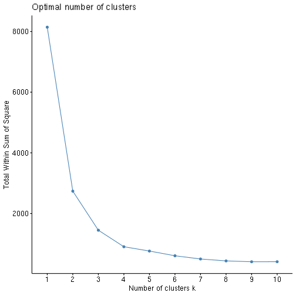
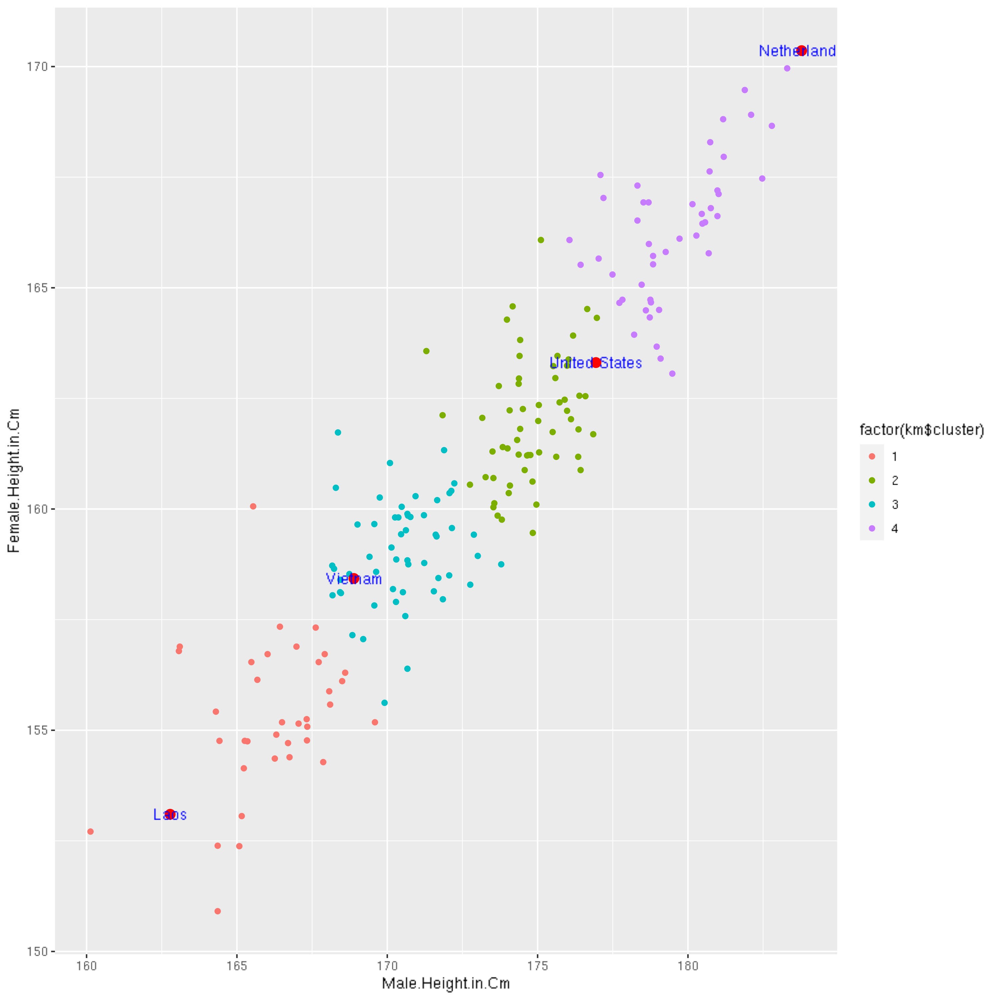

## Load data


```r
rm(list=ls())
library(ggplot2)
library(factoextra)
library(dplyr)
library(tidyverse)
df <- read.csv("https://raw.githubusercontent.com/vuminhtue/SMU_Data_Science_workflow_R/master/data/Heights/Height%20of%20Male%20and%20Female%20by%20Country%202022.csv",header=TRUE)
```

Find the optimum number of clusters:


```r
fviz_nbclust(df[,3:4], kmeans, method = "wss")
```



We can see that k=4 is optimum. Let's apply Kmeans clustering approach


```r
km <- kmeans(df[,3:4],4,nstart=20)
fviz_cluster(km,data=df[,3:4])
```


## Plot with highlight data:
Let select several countries and replot


```r
highlight_df <- select(filter(df, Country.Name %in% c("United States","Netherlands","Vietnam","Laos")),
                       c(Country.Name,Male.Height.in.Cm,Female.Height.in.Cm))


ggplot(df,aes(x=Male.Height.in.Cm,y=Female.Height.in.Cm))+
  geom_point(aes(color=factor(km$cluster)))+
  geom_point(data=highlight_df, 
             aes(x=Male.Height.in.Cm,y=Female.Height.in.Cm), 
             color='red',
             size=3)+
  annotate("text", x = highlight_df$Male.Height.in.Cm, y=highlight_df$Female.Height.in.Cm,
           label = highlight_df$Country.Name, colour = "blue")   
```



## List the country names on each clusters


```r
print(paste("Cluster 2's countries are: ", df[km$cluster==2,2],sep = ""))
```

```
##  [1] "Cluster 2's countries are: Jamaica"              
##  [2] "Cluster 2's countries are: United States"        
##  [3] "Cluster 2's countries are: Tunisia"              
##  [4] "Cluster 2's countries are: Russia"               
##  [5] "Cluster 2's countries are: Hungary"              
##  [6] "Cluster 2's countries are: North Macedonia"      
##  [7] "Cluster 2's countries are: Libya"                
##  [8] "Cluster 2's countries are: Turkey"               
##  [9] "Cluster 2's countries are: Morocco"              
## [10] "Cluster 2's countries are: Senegal"              
## [11] "Cluster 2's countries are: Spain"                
## [12] "Cluster 2's countries are: Trinidad and Tobago"  
## [13] "Cluster 2's countries are: Israel"               
## [14] "Cluster 2's countries are: Georgia"              
## [15] "Cluster 2's countries are: Seychelles"           
## [16] "Cluster 2's countries are: Brazil"               
## [17] "Cluster 2's countries are: China"                
## [18] "Cluster 2's countries are: Iran"                 
## [19] "Cluster 2's countries are: Moldova"              
## [20] "Cluster 2's countries are: South Korea"          
## [21] "Cluster 2's countries are: Kazakhstan"           
## [22] "Cluster 2's countries are: Tonga"                
## [23] "Cluster 2's countries are: Palestine"            
## [24] "Cluster 2's countries are: Algeria"              
## [25] "Cluster 2's countries are: Mali"                 
## [26] "Cluster 2's countries are: Kuwait"               
## [27] "Cluster 2's countries are: Jordan"               
## [28] "Cluster 2's countries are: Hong Kong"            
## [29] "Cluster 2's countries are: Argentina"            
## [30] "Cluster 2's countries are: North Korea"          
## [31] "Cluster 2's countries are: Dominican Republic"   
## [32] "Cluster 2's countries are: Egypt"                
## [33] "Cluster 2's countries are: Suriname"             
## [34] "Cluster 2's countries are: Italy"                
## [35] "Cluster 2's countries are: Samoa"                
## [36] "Cluster 2's countries are: Bahamas"              
## [37] "Cluster 2's countries are: Malta"                
## [38] "Cluster 2's countries are: Turkmenistan"         
## [39] "Cluster 2's countries are: Portugal"             
## [40] "Cluster 2's countries are: Uruguay"              
## [41] "Cluster 2's countries are: Bulgaria"             
## [42] "Cluster 2's countries are: United Arab Emirates" 
## [43] "Cluster 2's countries are: Albania"              
## [44] "Cluster 2's countries are: Costa Rica"           
## [45] "Cluster 2's countries are: Azerbaijan"           
## [46] "Cluster 2's countries are: Fiji"                 
## [47] "Cluster 2's countries are: Greenland"            
## [48] "Cluster 2's countries are: Paraguay"             
## [49] "Cluster 2's countries are: Saint Kitts and Nevis"
## [50] "Cluster 2's countries are: Armenia"              
## [51] "Cluster 2's countries are: Cuba"                 
## [52] "Cluster 2's countries are: Venezuela"            
## [53] "Cluster 2's countries are: Taiwan"               
## [54] "Cluster 2's countries are: Singapore"            
## [55] "Cluster 2's countries are: Qatar"                
## [56] "Cluster 2's countries are: Botswana"             
## [57] "Cluster 2's countries are: Cyprus"               
## [58] "Cluster 2's countries are: Chad"                 
## [59] "Cluster 2's countries are: Tuvalu"
```

```r
print(paste("United States is in cluster number: ", km$cluster[df$Country.Name=="United States"],sep=""))
```

```
## [1] "United States is in cluster number: 2"
```
