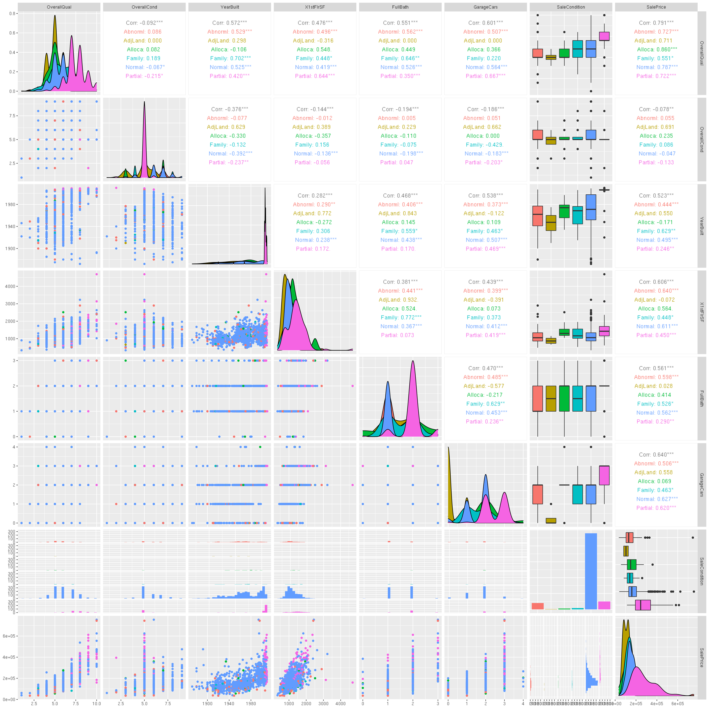

## Kaggle house price prediction

This is the sample R Markdown file following the workshop to create the template for Data Science workflow that we learnt inside class:

### Step 1: Load library, Load data


```r
rm(list=ls())
library(caret)
```

```
## Loading required package: lattice
```

```
## 
## Attaching package: 'caret'
```

```
## The following object is masked from 'package:purrr':
## 
##     lift
```

```r
library(GGally)
```

```
## Registered S3 method overwritten by 'GGally':
##   method from   
##   +.gg   ggplot2
```

```r
library(ggplot2)
library(RColorBrewer)
setwd("/home/tuev/Kaggle/house-prices")

df_train <- read.csv("https://raw.githubusercontent.com/vuminhtue/SMU_Data_Science_workflow_R/master/data/Kaggle_house_prices/train.csv",head=T)
df_test <- read.csv("https://raw.githubusercontent.com/vuminhtue/SMU_Data_Science_workflow_R/master/data/Kaggle_house_prices/test.csv",head=T)
```


### Step 2: Select variables and check for missing value


```r
df_small <- df_train[c("OverallQual","OverallCond","YearBuilt","X1stFlrSF",
                       "FullBath","GarageCars","SaleCondition","SalePrice")]
ggpairs(df_small,aes(colour=SaleCondition))
```

```
## 
 plot: [1,1] [>-------------------------------------------------------------------------]  2% est: 0s 
 plot: [1,2] [=>------------------------------------------------------------------------]  3% est: 7s 
 plot: [1,3] [==>-----------------------------------------------------------------------]  5% est: 7s 
 plot: [1,4] [====>---------------------------------------------------------------------]  6% est: 6s 
 plot: [1,5] [=====>--------------------------------------------------------------------]  8% est: 6s 
 plot: [1,6] [======>-------------------------------------------------------------------]  9% est: 6s 
 plot: [1,7] [=======>------------------------------------------------------------------] 11% est: 6s 
 plot: [1,8] [========>-----------------------------------------------------------------] 12% est: 6s 
 plot: [2,1] [=========>----------------------------------------------------------------] 14% est: 6s 
 plot: [2,2] [===========>--------------------------------------------------------------] 16% est: 6s 
 plot: [2,3] [============>-------------------------------------------------------------] 17% est: 6s 
 plot: [2,4] [=============>------------------------------------------------------------] 19% est: 6s 
 plot: [2,5] [==============>-----------------------------------------------------------] 20% est: 6s 
 plot: [2,6] [===============>----------------------------------------------------------] 22% est: 6s 
 plot: [2,7] [================>---------------------------------------------------------] 23% est: 5s 
 plot: [2,8] [=================>--------------------------------------------------------] 25% est: 6s 
 plot: [3,1] [===================>------------------------------------------------------] 27% est: 5s 
 plot: [3,2] [====================>-----------------------------------------------------] 28% est: 5s 
 plot: [3,3] [=====================>----------------------------------------------------] 30% est: 5s 
 plot: [3,4] [======================>---------------------------------------------------] 31% est: 5s 
 plot: [3,5] [=======================>--------------------------------------------------] 33% est: 5s 
 plot: [3,6] [========================>-------------------------------------------------] 34% est: 5s 
 plot: [3,7] [==========================>-----------------------------------------------] 36% est: 5s 
 plot: [3,8] [===========================>----------------------------------------------] 38% est: 5s 
 plot: [4,1] [============================>---------------------------------------------] 39% est: 5s 
 plot: [4,2] [=============================>--------------------------------------------] 41% est: 4s 
 plot: [4,3] [==============================>-------------------------------------------] 42% est: 4s 
 plot: [4,4] [===============================>------------------------------------------] 44% est: 4s 
 plot: [4,5] [=================================>----------------------------------------] 45% est: 4s 
 plot: [4,6] [==================================>---------------------------------------] 47% est: 4s 
 plot: [4,7] [===================================>--------------------------------------] 48% est: 4s 
 plot: [4,8] [====================================>-------------------------------------] 50% est: 4s 
 plot: [5,1] [=====================================>------------------------------------] 52% est: 4s 
 plot: [5,2] [======================================>-----------------------------------] 53% est: 3s 
 plot: [5,3] [=======================================>----------------------------------] 55% est: 3s 
 plot: [5,4] [=========================================>--------------------------------] 56% est: 3s 
 plot: [5,5] [==========================================>-------------------------------] 58% est: 3s 
 plot: [5,6] [===========================================>------------------------------] 59% est: 3s 
 plot: [5,7] [============================================>-----------------------------] 61% est: 3s 
 plot: [5,8] [=============================================>----------------------------] 62% est: 3s 
 plot: [6,1] [==============================================>---------------------------] 64% est: 3s 
 plot: [6,2] [================================================>-------------------------] 66% est: 3s 
 plot: [6,3] [=================================================>------------------------] 67% est: 2s 
 plot: [6,4] [==================================================>-----------------------] 69% est: 2s 
 plot: [6,5] [===================================================>----------------------] 70% est: 2s 
 plot: [6,6] [====================================================>---------------------] 72% est: 2s 
 plot: [6,7] [=====================================================>--------------------] 73% est: 2s 
 plot: [6,8] [=======================================================>------------------] 75% est: 2s 
 plot: [7,1] [========================================================>-----------------] 77% est: 2s `stat_bin()` using `bins = 30`. Pick better value with `binwidth`.
## 
 plot: [7,2] [=========================================================>----------------] 78% est: 2s `stat_bin()` using `bins = 30`. Pick better value with `binwidth`.
## 
 plot: [7,3] [==========================================================>---------------] 80% est: 2s `stat_bin()` using `bins = 30`. Pick better value with `binwidth`.
## 
 plot: [7,4] [===========================================================>--------------] 81% est: 2s `stat_bin()` using `bins = 30`. Pick better value with `binwidth`.
## 
 plot: [7,5] [============================================================>-------------] 83% est: 2s `stat_bin()` using `bins = 30`. Pick better value with `binwidth`.
## 
 plot: [7,6] [=============================================================>------------] 84% est: 2s `stat_bin()` using `bins = 30`. Pick better value with `binwidth`.
## 
 plot: [7,7] [===============================================================>----------] 86% est: 1s 
 plot: [7,8] [================================================================>---------] 88% est: 1s 
 plot: [8,1] [=================================================================>--------] 89% est: 1s 
 plot: [8,2] [==================================================================>-------] 91% est: 1s 
 plot: [8,3] [===================================================================>------] 92% est: 1s 
 plot: [8,4] [====================================================================>-----] 94% est: 1s 
 plot: [8,5] [======================================================================>---] 95% est: 0s 
 plot: [8,6] [=======================================================================>--] 97% est: 0s 
 plot: [8,7] [========================================================================>-] 98% est: 0s `stat_bin()` using `bins = 30`. Pick better value with `binwidth`.
## 
 plot: [8,8] [==========================================================================]100% est: 0s 
                                                                                                      
```



```r
sum(is.na(df_small))
```

```
## [1] 0
```

Convert SaleCondition to integer:


```r
df_small$SaleCondition <- as.integer(as.factor(df_small$SaleCondition))
```

### Step 3: Create partition for the data


```r
ind1 <- createDataPartition(y=df_small$SalePrice,p=0.6,list=FALSE,times=1)
training <- df_small[ind1,]
testing  <- df_small[-ind1,] 
```

### Step 4: Apply 1 ML algorithm to the data and calculate prediction

Apply Random Forest:


```r
model_rf <- train(SalePrice~., data=training,method="rf",
                  prox=TRUE)
predict_rf <- predict(model_rf,testing)
```

Apply Neural Network


```r
library(neuralnet)
```

```
## 
## Attaching package: 'neuralnet'
```

```
## The following object is masked from 'package:dplyr':
## 
##     compute
```

```r
smax <- apply(training,2,max)
smin <- apply(training,2,min)
trainNN <- as.data.frame(scale(training,center=smin,scale=smax-smin))
testNN <- as.data.frame(scale(testing,center=smin,scale=smax-smin))

set.seed(123)
ModNN <- neuralnet(SalePrice~.,trainNN, hidden=c(4,3),linear.output = T)

predictNN <- compute(ModNN,testNN)
predictNN_rescaled <- predictNN$net.result*(smax-smin)[1]+smin[1]
```


```r
plot(ModNN)
```


### Step 5: Evaluate the model output

Since the model output is continuous output, we use postResample to evaluate:


```r
print(postResample(predict_rf,testing$SalePrice))
```

```
##         RMSE     Rsquared          MAE 
## 3.555839e+04 8.102577e-01 2.251900e+04
```

```r
print(postResample(predictNN_rescaled,testing$SalePrice))
```

```
##         RMSE     Rsquared          MAE 
## 1.985016e+05 7.756623e-01 1.810589e+05
```

Display the scatter plots:


```r
testing$predicted_rf <- predict_rf
ggplot(testing,aes(x=SalePrice,y=predict_rf))+
  geom_point(aes(color=factor(YearBuilt)))+
  geom_smooth(method="loess")
```

```
## `geom_smooth()` using formula 'y ~ x'
```


Since the Random Forest gave better results, we use this algorithm to predict the testing data:


### Step 6: Predict the test data and write output


```r
df_small_test <- df_test[c("OverallQual","OverallCond","YearBuilt","X1stFlrSF",
                       "FullBath","GarageCars","SaleCondition")]
df_small_test$SaleCondition <- as.integer(as.factor(df_small_test$SaleCondition))

output <- predict(model_rf,df_small_test)
output <- cbind(df_test$Id,output)
colnames(output) <- c("ID","SalePrice")
write.csv(output,"Output.csv",row.names = FALSE)
```
